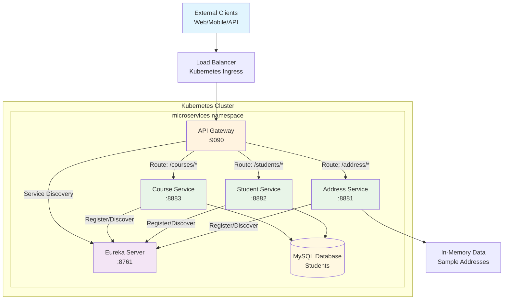
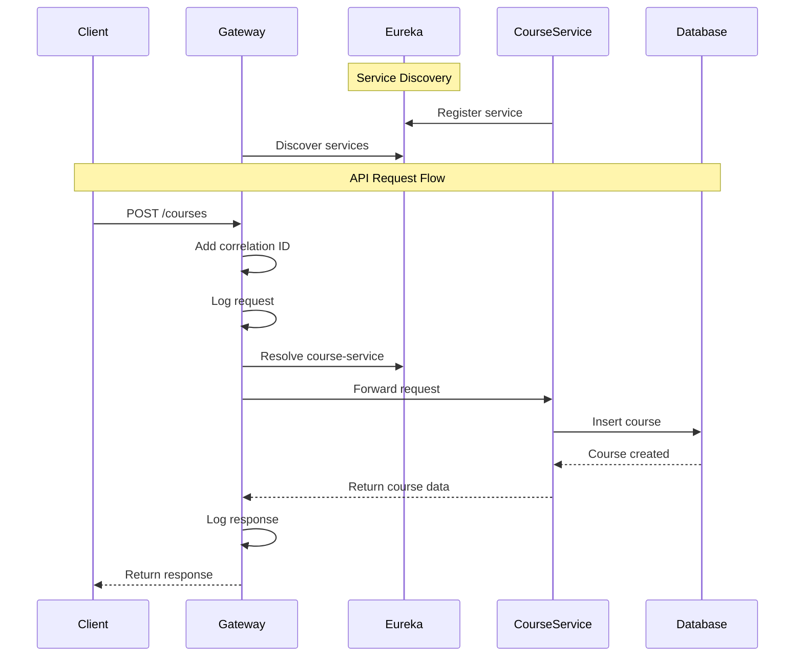
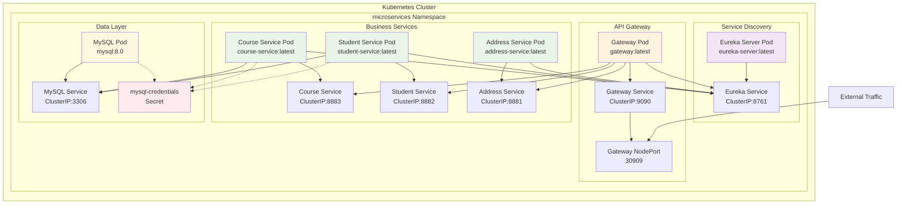
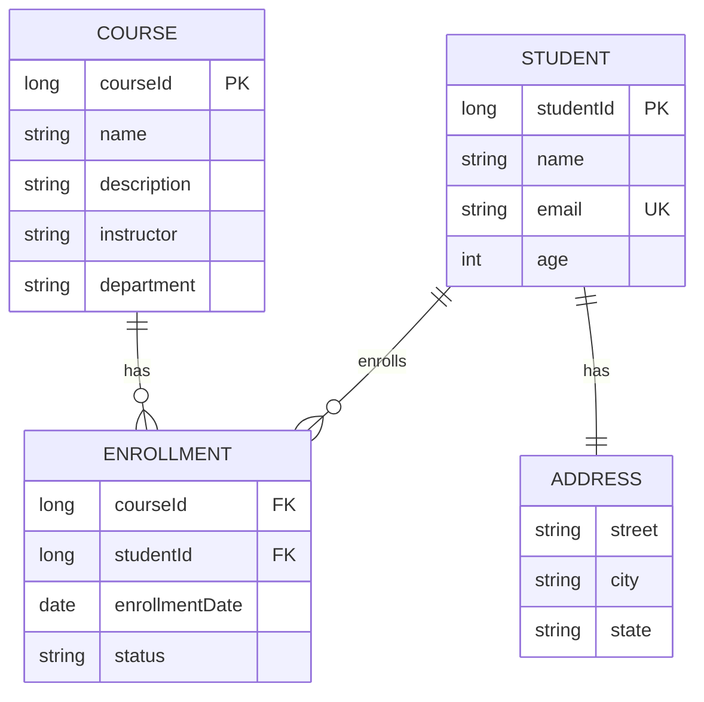
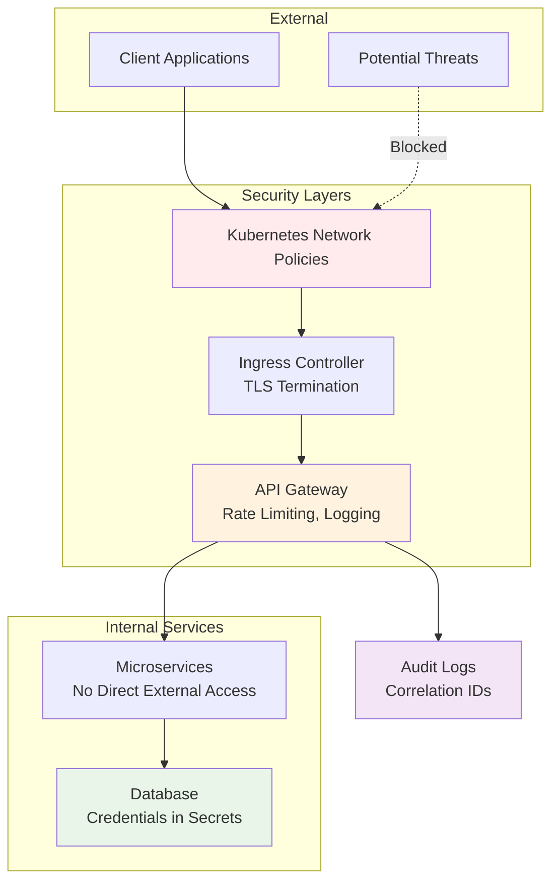
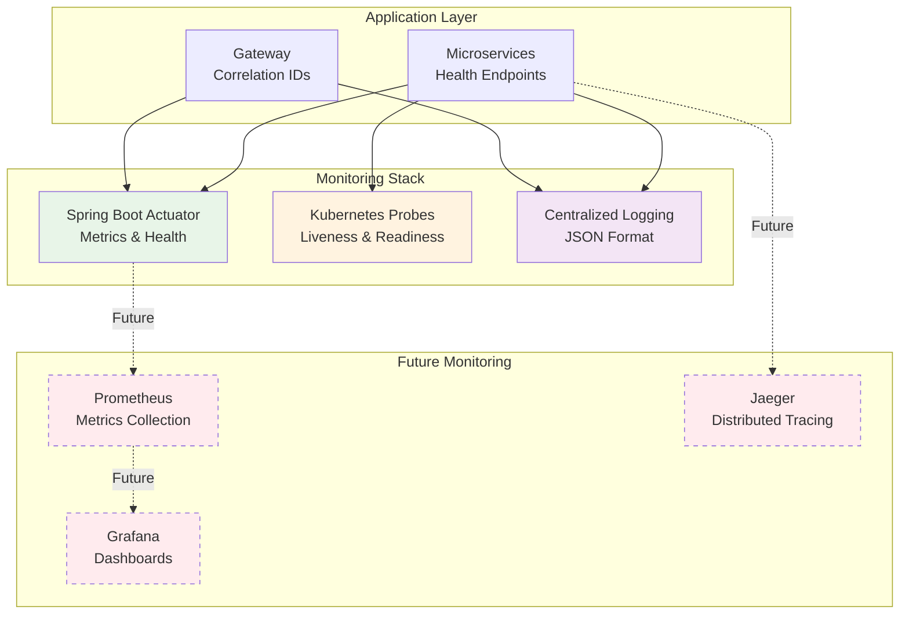
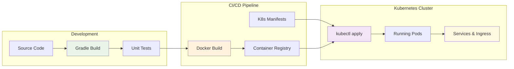
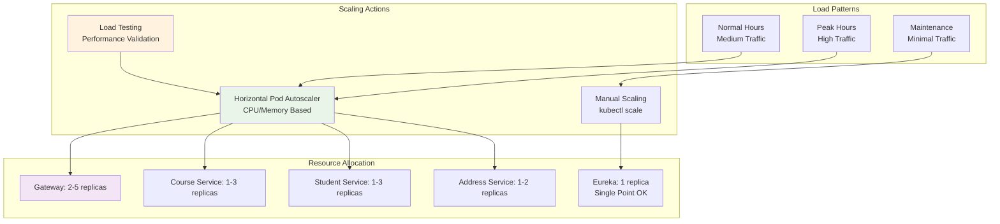

# Architecture Diagrams

This document contains detailed architecture diagrams for the microservices system.

## High-Level Architecture

## Service Communication Flow

## Kubernetes Deployment Architecture

## Data Model Relationships

## Security Architecture

## Monitoring and Observability

## Deployment Flow

## Service Scaling Strategy

